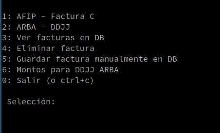
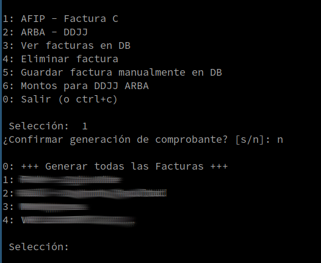
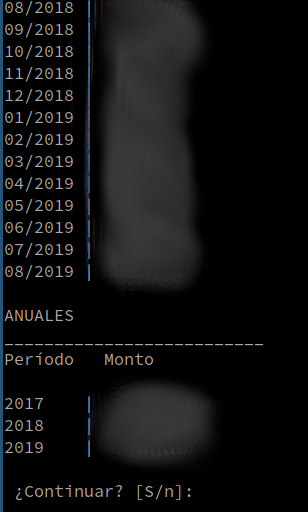

# AFIP

Generación automática de comprobantes en línea (AFIP) y declaraciones juradas (ARBA) utilizando selenium.

- Histórico en SQLite.
- Generar facturas programadas una en una, o todas a la vez. 
- Ver montos calculados para DDJJ arba.

python menu.py

